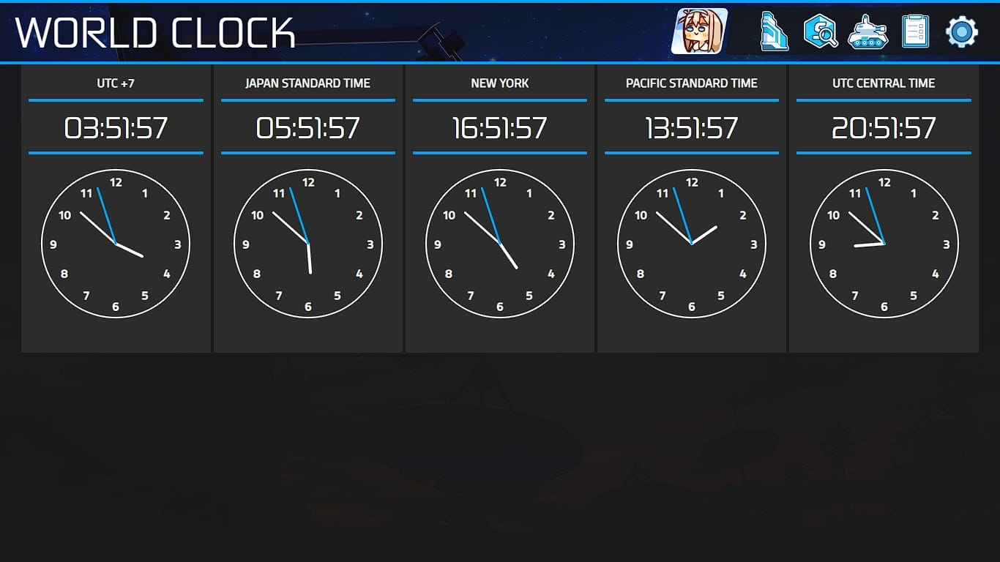

# ISEPHYR 

Isephyr is a *__"GAME USER INTERFACE BASED PERSONALIZED APPLICATION"__*.

So, basically it's a launcher-like app similar to your app launcher for your game or your application in your phone but this taking one or more Game UI as reference for the design. Most of the part the UI copies lot of element from Gacha games, where you can see your *__Waifu__* in the home page and same as this one, you can set a custom interactive waifu, with a custom voice and expression
> ( well, of course if your waifu supports it though )

So yeah, it's basically a *__"WAIFU LAUNCHER!!"__*

This is also not a normal launcher where you just browing local html file or run application through a Electron.js web framework, there are lot of features and you can them check below. Well, some part still in BETA, I'm still figuring out how it works so yeah, this still in-development.

Because this application is running using web based program created using HTML, CSS and Javascript under Electron.js Framework. It's really easy to write / design the application from scratch.

## The Lists

- [Feature List](#Features)
- [Requirement](#Requirement)
- [Installation](#Installation)
- [Tutorial](#Tutorial)
- [Question](#Question)
- [Screenshots](#Screenshots)

## Feature List

#### ☆ Currently In Development
* [x] Partial DarkMode
* [ ] Full DarkMode
* [ ] Gacha Game Daily Reset / Patch Reset 
* [ ] Next Airing Anime [ 24Hr/1D Span ]
* [ ] Currency Update 
* [ ] Genshin Grinding List 
* [x] World Clock
* [ ] Seamless World Clock
* [ ] Pagination for Anime / Bookmark Database
* [ ] BETTER UI for Bookmark Page
* [ ] Sorting Database from A - Z
* [ ] Interactive Live2D Character
* [ ] Calendar Module
* [ ] Custom Calculator [ Normal | Currency | Mass | Length | Temperature | Power | Data ]
* [ ] Color Pallete
* [ ] WebptoJPG
* [ ] Image to Base64
* [ ] JSON Editor / Extractor
* [ ] HTML Editor / Extractor
* [ ] Gantt Project

------

#### ★ Available Features

| Feature Name | Description | Related NPM | Module Name |
|:--------------:|:--------------:|:--------------:|:--------------:|
| Anime Database | Anime Database is where you can check your Anime lists locally and interact with it. | none | module_db_Anime  |
| Waifu Database | The list of waifu you can have in this Application, at max you can show 12 of them. | SQLite3 | module_db_waifu  |
| Genshin Database | Just a Locally Installed Genshin Database, you can check lot of materials, character, information data etc in here | none | module_db_genshin  |
| A4 Projects | This is a private module | none | module_db_A4  |
| Bookmark Database | This is where you can save all of your internet bookmark and track the progress | SQLite3 | module_db_bookmark  |
| <i style="color:red;">Lyrics Database</i> | This is the database of your saved music lyrics, find and show lyrics more easier | SQLite3 | module_db_lyrics   |
| <i style="color:red;">Save File Database</i> | This is the a database of your Game Save File, just in case | SQLite3 | module_db_save   |

#### ★ Page Structure
| Main File | First Page | Second Page | Third Page
|:--------------:|:--------------|:--------------|:--------------|
| Main.js > Login Page | ✴️ Dashboard | ▶ World clock  |
|  | | ▶ Log Page |
|  | | ▶ ??? Page |
|  | | ▶ ChatGPT Page |
|  | | ▶ Design Page |
|  | ✴️ Now Page |
|  | ✴️ Profile Page |
|  | ✴️ Shortcut Page |
|  | ✴️ Database Page | ▶ Anime Database | ❇️ Editor  |
|  | | ▶ Waifu Database |
| | | ▶ Genshin Database |
| | | ▶ A4 Projects |
| | | ▶ Bookmark Database | ❇️ Editor |
| | | ▶ Lyrics Database |
| | | ▶ Save File Database|
| | ✴️ Settings Page |

## Requirement

List of NPM Requirement to make this app work

> npm install electron-context-menu [ Electron Context Menu ]() 
> npm install fs *"and/or"* npm install fs-extra [ FS or File System ]() 
> npm install howler [ Howler for Audio ]() 
> npm install path [ Path ]() 
> npm install sqlite3 [ Sqlite3 ]() 
> npm install electron --save-dev [ Electron.js Main Module ]()

> npm install dev electron-builder [ Electron Builder if needed ]()

## Installation

 Current not available

## Question

 Current not available

## Screenshots

	
	 
	<em>Main Homepage</em>

	
	 
	<em>Main Homepage with Character L2D Active</em>

	
	 
	<em>World Clock</em>

	
	 
	<em>Database Page</em>

	
	 
	<em>Waifu List Page</em>

	
	 
	<em>Anime List Page</em>

	
	 
	<em>Bookmark Page</em>

	
	 
	<em>Settings Page</em>

------
